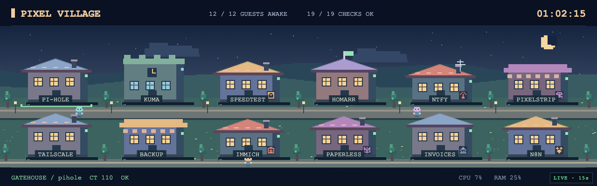
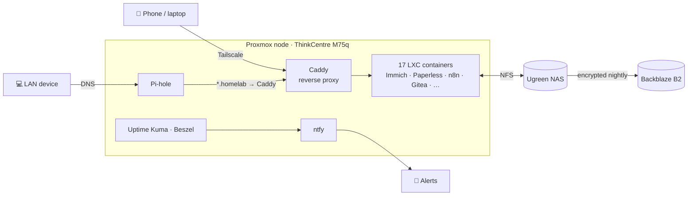

# Mateusz Pawlowski

**Software · Automation · Homelabbing · Hardware**

---

### 👋 About Me

I'm an **AI Associate at Reyes Holdings**, where I use AI to streamline and automate business processes. Outside of work I build self-hosted tools, run a homelab, and tinker with local LLMs.

---

### 🛠️ Tech Stack

  

  
  
  
  
  
  

---

### 🧵 Loom — Local-First AI Memory System

A self-hosted knowledge engine that turns scattered notes and conversations into a queryable, interconnected memory graph — running entirely on your own hardware.

- **Multi-agent architecture** — specialized agents handle ingestion, retrieval, summarization, and validation independently
- **Local-first & private** — runs on local models via Ollama; your data never leaves your machine
- **Tiered model routing** — intelligently routes between local inference, OpenRouter, and cloud providers based on task complexity
- **Knowledge graph UI** — React + Sigma.js frontend visualizes memories as an explorable graph
- **Stack** — FastAPI · LanceDB · React · Sigma.js · Ollama

🔗 **[View the repo →](https://github.com/Mpawlowski5467/Loom)**

---

### 🏟️ SportsDash — Self-Hosted Sports Dashboard

**Ten sports · 50+ leagues · one self-hosted screen.** A single-user dashboard for a wall display, desktop tab, or phone — live scores, calendar, standings, stat leaders, playoff brackets, rosters, news, and a world map of stadiums.

  

- **Ten sports** — basketball, baseball, soccer, hockey, football, tennis, MMA, golf, motorsport, and volleyball
- **Live everything** — auto-refreshing scores, box scores, race and golf leaderboards, and playoff brackets
- **Push notifications** via ntfy — game starts, finals, and injury alerts for players you follow
- **Runs anywhere** — `docker compose up` as a server, or a native macOS app with the backend bundled in
- **Private by design** — no accounts, no tracking, no API keys
- **Stack** — FastAPI · React · Vite · Bun · PostgreSQL · Redis · MapLibre · Tauri

🔗 **[View the repo →](https://github.com/Mpawlowski5467/SportsDash)**

---

### 🖥️ Homelab

A single-node **Proxmox** lab in a portable rack — **17 Docker-in-LXC containers**, one per service, all behind one reverse proxy with a wildcard TLS cert. Nothing is exposed to the internet: everything is reachable on the LAN or over **Tailscale** only. The whole lab is managed as code in a private repo.

  
   
  The rack's 1280×400 status panel — one of 14 animated views driven by live lab telemetry

  
  
  
  
  
  
  
  
  
  
  
  
  
  
  
  
  
  

| Hardware | Specs |
|---|---|
| **Rack** | RackMate T1 with a 1280×400 status panel |
| **Node** | Lenovo ThinkCentre M75q — AMD Ryzen 3 PRO 5350GE (4C/8T) · 30 GiB RAM · 447 GB SSD · Proxmox VE 9 |
| **Storage** | Ugreen NAS — 2 TB NFS for photos, documents, and nightly backups |
| **GPU** | NVIDIA RTX 3060 12GB — local LLM inference |

| Area | Services |
|---|---|
| **Network & access** | Pi-hole (DNS / ad blocking) · Caddy (reverse proxy, Let's Encrypt wildcard) · Tailscale (subnet router + split DNS) |
| **Monitoring** | Homarr (start page) · Uptime Kuma · Beszel (metrics) · ntfy (push alerts) · Speedtest Tracker · Pixel strip (rack display) |
| **Apps** | Immich (photos) · Paperless-ngx (OCR'd documents) · Invoice Ninja · n8n (automation) · Actual Budget · Gitea · Syncthing |
| **Backups** | Nightly vzdump to the NAS → encrypted rclone sync to Backblaze B2, plus automated restore tests |

---

### 🚀 What I'm Working On

- 💼 &nbsp;Automating business processes as an **AI Associate at Reyes Holdings**
- 🧵 &nbsp;Building **[Loom](https://github.com/Mpawlowski5467/Loom)** — a local-first AI memory system with a multi-agent backend
- 🏟️ &nbsp;Shipping **[SportsDash](https://github.com/Mpawlowski5467/SportsDash)** — a self-hosted sports dashboard for ten sports
- 🤖 &nbsp;Self-hosting local LLMs on an **RTX 3060 12GB**
- 🖥️ &nbsp;Running a **17-container Proxmox homelab** — managed as code, backed up off-site, monitored end to end
- 🐧 &nbsp;Daily drivers: **Omarchy** desktop · **MacBook Air M2** · **ThinkPad T14**

---

  <picture>
    <source media="(prefers-color-scheme: dark)" srcset="https://raw.githubusercontent.com/Mpawlowski5467/Mpawlowski5467/output/github-snake-dark.svg" />
    <source media="(prefers-color-scheme: light)" srcset="https://raw.githubusercontent.com/Mpawlowski5467/Mpawlowski5467/output/github-snake.svg" />
    
  </picture>

